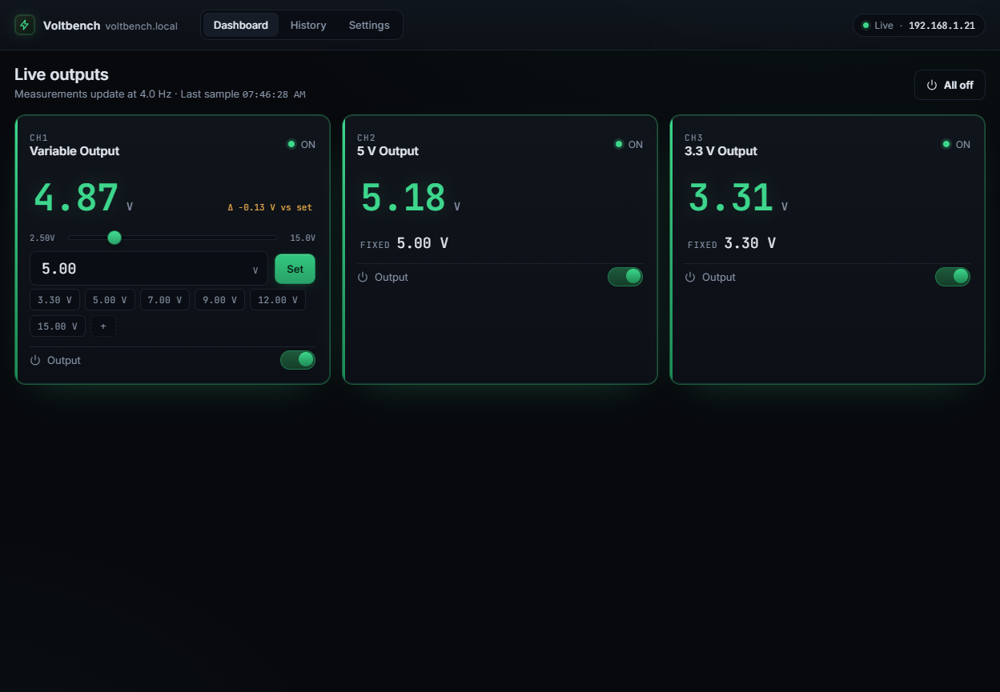
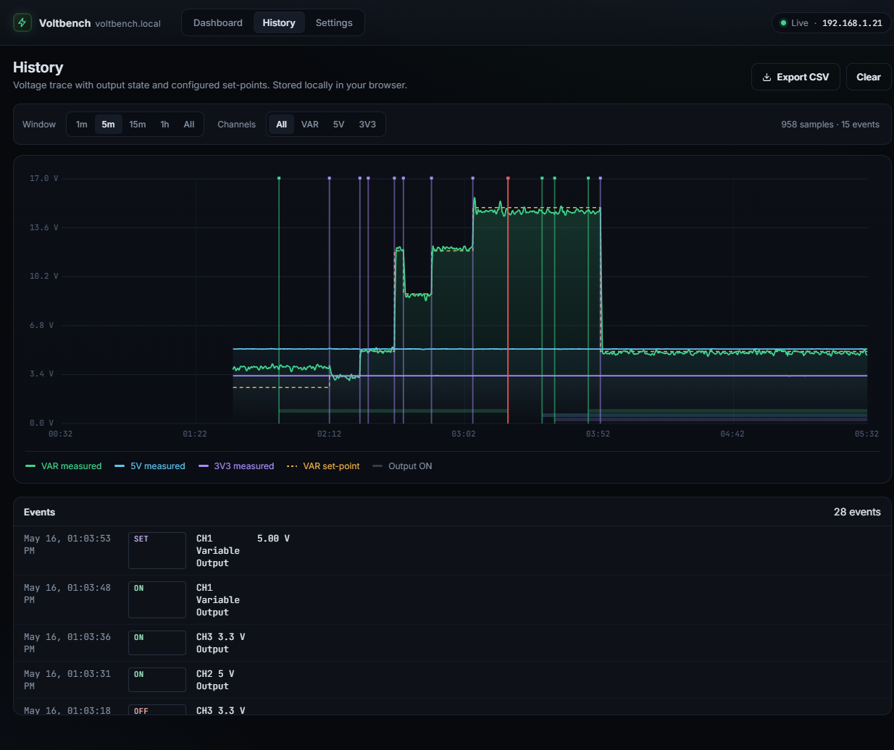
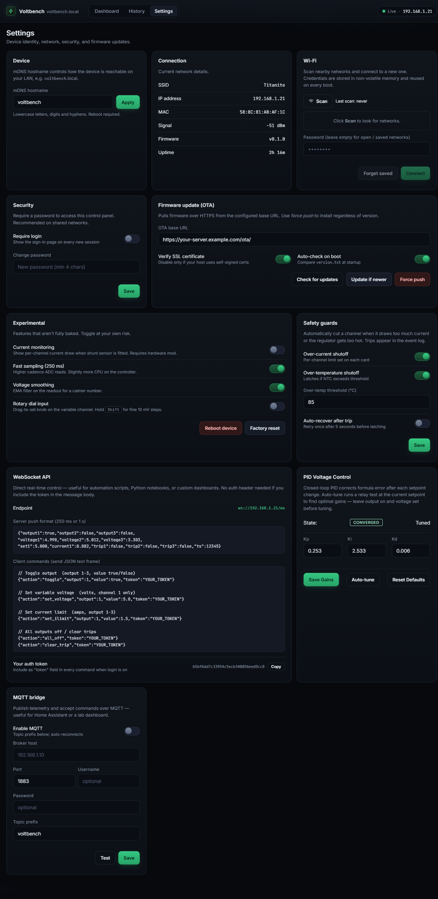

# Voltbench — ESP32-C3 Programmable Power Supply

A three-channel bench power supply controlled over Wi-Fi, built around an **ESP32-C3 Super Mini**. The variable channel uses an LM2596-ADJ buck converter set by an MCP4017 I2C digital potentiometer, driven by a calibration-map "deadbeat" controller: it jumps to the mapped wiper step, verifies with one filtered ADC sample, applies at most one single-step correction, and freezes — no hunting, settled in under a second. Two fixed rails deliver regulated 5 V and 3.3 V. Everything is managed through a dark-themed responsive web UI served directly from the microcontroller — no app, no cloud, no dependencies.

Designed and developed by **Aditya Biswas**.

---

## Screenshots

| Dashboard | History | Settings |
|-----------|---------|----------|
|  |  |  |

---

## Features

### Power Outputs
| Channel | Rail | Range | Regulation |
|---------|------|-------|------------|
| CH1 | LM2596-ADJ (variable) | 2.5 V – 15 V | map-based deadbeat control + on-device calibration sweep |
| CH2 | Mini360 (fixed 5 V) | 5.0 V | Passthrough (monitor only) |
| CH3 | LM1117-3.3 (LDO, fixed) | 3.3 V | Passthrough (monitor only) |

### Accuracy (measured, after calibration sweep)
| Setpoint | Measured | Error |
|----------|----------|-------|
| 3.3 V | 3.22 V | −80 mV (2.4%) |
| 5.0 V | 4.99 V | −10 mV (0.2%) |
| 9.0 V | 8.98 V | −20 mV (0.2%) |
| 12.0 V | 12.29 V | +290 mV (2.4%) |
| 15.0 V | 15.55 V | +550 mV (3.7%) |

> Accuracy is limited by wiper-step quantization (~27 mV/step at low voltages, up to ~1 V/step near the ceiling). Run Settings → Calibration → Run sweep once after assembly (CH1 unloaded).

### Web UI
- **Dashboard** — live voltage at 4 Hz, per-channel enable toggles, voltage slider, preset chips (right-click to delete, ＋ to save current), delta indicator, All Off button
- **History** — bezier-smoothed time-series graph with SMA noise reduction, channel filters, event markers (output on/off), adjustable time window (1 min – 12 h)
- **Settings** — mDNS hostname, security/login, Wi-Fi management (scan/connect/forget, stores up to 4 SSIDs), OTA update, experimental flags (dial mode, EMA smoothing, fast poll), MQTT bridge
- **Calibration card** — run/clear the CH1 calibration sweep and see whether a valid map is loaded
- **Device log pane** — live firmware log streamed over a view-only WebSocket (`/logws`)
- **Web-upload OTA** — flash a `.bin` straight from the browser, with real upload/flash progress

### Connectivity
- **WebSocket** `/ws` — server pushes full status JSON at up to 4 Hz; also accepts control commands
- **REST API** — full control and configuration via `/api/*` endpoints
- **mDNS** — reachable at `http://voltbench.local/` on any mDNS-capable host (Windows, macOS, Linux, iOS)
- **Captive portal** — automatically falls back to AP mode (`VoltbenchAP`) when no saved Wi-Fi connects; re-tries every 30 s
- **Telnet console** (`:23`) and USB serial console — single-letter commands: `v<volts>` set CH1, `o1`/`o0` output on/off, `m` run calibration sweep, `c` cal status, `?` full state dump

### Management
- **OTA update** — pulls firmware from this repo's GitHub "latest release" assets on demand or auto-check on boot; web-upload OTA as a second, USB-free path
- **NVS persistence** — all settings, the CH1 calibration map, and Wi-Fi credentials survive power cycles and OTA updates
- **MQTT bridge** — publishes 1 Hz telemetry; subscribes to control topics
- **Factory reset** — wipes all NVS from Settings → Factory Reset
- **Token auth** — optional bearer-token login (stored in `sessionStorage`, persists across reboots)

---

## Hardware

### Bill of Materials

| Component | Part | Notes |
|-----------|------|-------|
| MCU | ESP32-C3 Super Mini | 4 MB flash, Wi-Fi 802.11 b/g/n |
| Variable regulator | LM2596-ADJ module | Adjustable buck, ~3–35 V input |
| Fixed 5 V | Mini360 module | Fixed-output synchronous buck |
| Fixed 3.3 V | LM1117-3.3 | LDO, TO-92 or SOT-223 |
| Digital pot | MCP4017T-103E/LT | 10 KΩ, 128 steps, I2C @ 0x2F |
| R1 (feedback) | 10 KΩ 1% | VOUT → FB (ADJ) on LM2596 |
| R_adc_top | 47 KΩ | CH1 ADC voltage divider high-side |
| R_adc_bot | 1 KΩ | CH1 ADC voltage divider low-side |
| R_5v / R_3v3 | 10 KΩ × 4 | CH2 and CH3 ADC dividers (÷2 each) |
| Enable switches | N-ch MOSFET or relay × 3 | Logic-level control from GPIO 5/6/7 |

### Pin Map

| GPIO | Function |
|------|----------|
| 0 | ADC CH1 — variable rail (47K:1K divider, ×48 scale) |
| 1 | ADC CH2 — 5 V rail (10K:10K divider, ×2 scale) |
| 3 | ADC CH3 — 3.3 V rail (10K:10K divider, ×2 scale) |
| 5 | Enable CH1 (variable output) |
| 6 | Enable CH2 (5 V output) |
| 7 | Enable CH3 (3.3 V output) |
| 8 | I2C SDA → MCP4017 |
| 9 | I2C SCL → MCP4017 |

### LM2596-ADJ Feedback Network

```
VOUT ──── 10 KΩ ──── FB (ADJ) ──── MCP4017 wiper ──── GND
                                     (0 – 10 KΩ)
```

`Vout = 1.235 × (1 + 10 000 / R2)` where R2 is the MCP4017 resistance.

| Target | R2 needed | MCP4017 step |
|--------|-----------|--------------|
| 2.5 V | 9.87 KΩ | 125 / 127 |
| 5.0 V | 3.27 KΩ | 41 / 127 |
| 9.0 V | 1.56 KΩ | 20 / 127 |
| 12.0 V | 1.13 KΩ | 14 / 127 |
| 15.0 V | 0.87 KΩ | 11 / 127 |

### CH1 ADC Divider

```
VOUT ──── 47 KΩ ──── GPIO0 ──── 1 KΩ ──── GND
                       ↑
                  ADC reads here (0 – 2.5 V with ADC_11db)
                  Scale factor = 48 → supports up to ~27 V
```

---

## Firmware

### Prerequisites

- **Arduino IDE 2.x** with ESP32 Arduino core (Espressif) v3.x
- Libraries (Library Manager):
  - `ESPAsyncWebServer` + `AsyncTCP`
  - `ArduinoJson` v7
  - `PubSubClient` *(only if MQTT is needed)*

  (The MCP4017 digital pot is driven with direct I2C register writes — no digital-pot library needed.)

### Build & Flash

1. Clone the repository:
   ```sh
   git clone https://github.com/your-username/ESP32-Programmable-Power-Supply.git
   ```

2. Edit `ESP32_power_supply/credential.h` with your Wi-Fi credentials (these only seed NVS the first time — if any SSID slot is already saved, they're ignored):
   ```cpp
   static const char *ssids[]     = { "YourSSID" };
   static const char *passwords[] = { "YourPassword" };
   ```
   OTA is not configurable here — it's pinned to this repo's GitHub "latest release" assets (see [OTA Updates](#ota-updates)).

3. In Arduino IDE, set:
   - Board: `ESP32C3 Dev Module`
   - Upload Speed: `921600`
   - Flash Size: `4MB`
   - Partition Scheme: **Custom** → select `ESP32_power_supply/partitions.csv`

4. Upload: **Sketch → Upload** (`Ctrl+U`)

5. Open Serial Monitor at **115200 baud** — you should see:
   ```
   Voltbench v2.1.0 booting...
   MCP4017 OK @ 0x2F
   Joined YourSSID — IP=192.168.x.x
   URL: http://voltbench.local/
   ```

6. Open `http://voltbench.local/` in any browser on the same network.

### Partition Layout

```
nvs        20 KB   Settings and Wi-Fi credentials
otadata     8 KB   OTA slot tracking
app0     1792 KB   Active firmware (~1.3 MB used)
app1     1792 KB   OTA staging slot
spiffs    448 KB   Reserved
```

### Regenerating the Web UI

After editing `new design/Power Supply.html`, run this PowerShell snippet to rebuild `web_page.h`:

```powershell
$html  = Get-Content "new design\Power Supply.html" -Raw -Encoding utf8
$bytes = [System.Text.UTF8Encoding]::new($false).GetBytes($html)
$ms    = [System.IO.MemoryStream]::new()
$gz    = [System.IO.Compression.GzipStream]::new($ms, [System.IO.Compression.CompressionLevel]::Optimal)
$gz.Write($bytes, 0, $bytes.Length); $gz.Close()
$gzBytes = $ms.ToArray()
$chunks  = for ($i = 0; $i -lt $gzBytes.Length; $i += 16) {
    "  " + (($gzBytes[$i..([Math]::Min($i+15,$gzBytes.Length-1))] |
    ForEach-Object { "0x{0:x2}" -f $_ }) -join ", ")
}
$header = @("#pragma once","const uint8_t index_html_gz[] PROGMEM = {",
            ($chunks -join ",`n"),"};",
            "const size_t index_html_gz_len = $($gzBytes.Length);")
[System.IO.File]::WriteAllLines("ESP32_power_supply\web_page.h", $header,
    [System.Text.UTF8Encoding]::new($false))
Write-Host "Done: $($bytes.Length) -> $($gzBytes.Length) bytes"
```

---

## Usage

### Calibration

On first flash CH1 has no calibration map, so the deadbeat controller falls back to a coarse built-in estimate. For rated accuracy, run the sweep once:

1. **Disconnect any load from CH1** — the sweep drives the output across its full range (~2.5 V → ceiling) and needs the rail unloaded to read clean.
2. In **Settings → Calibration**, click **Run sweep**. It steps the MCP4017 through all 128 positions, sampling each one — takes about a minute. The busy state is reported as `"busy"` in `/api/status` and rejects a second sweep request while running.
3. The resulting step→millivolt map is smoothed to be monotonic, marked valid, and persisted to NVS — it survives reboots and OTA updates (NVS is a separate flash partition the OTA slot swap never touches).

Re-run the sweep only if the hardware changes (different MCP4017, feedback resistor, or LM2596 module). Use **Clear** to wipe the map and fall back to the coarse estimate.

### Presets

- **Click** a preset chip to jump to that voltage instantly.
- **Right-click** a chip to delete it.
- **＋** saves the current slider position as a new preset (stored in browser `localStorage`).

### All Off

The **All off** button in the top-right cuts all three outputs simultaneously. Individual toggles restore each channel independently.

---

## REST API

All responses are JSON. When `require_login` is enabled, include header `X-Auth: <token>` on every request except `/api/login`.

| Method | Path | Description |
|--------|------|-------------|
| `GET` | `/api/status` | Live voltages and controller state |
| `GET` | `/api/info` | Device info, network, settings |
| `POST` | `/api/login` | `pass=…` → `{ok, token}` |
| `POST` | `/api/control` | Outputs and voltage (see below) |
| `POST` | `/api/settings` | JSON — any subset of settings |
| `GET` | `/api/wifi/scan` | Start scan → returns networks |
| `POST` | `/api/wifi/connect` | `ssid=…&pass=…` |
| `POST` | `/api/wifi/forget` | `ssid=…` |
| `GET` | `/api/ota/check` | Check GitHub for newer firmware (async: `202 {"checking":true}` while in flight) |
| `POST` | `/api/ota/update` | Pull from GitHub if newer |
| `POST` | `/api/ota/force` | Pull from GitHub unconditionally |
| `POST` | `/api/ota/upload` | Multipart `.bin` upload → flashes the inactive OTA slot, reboots on success |
| `POST` | `/api/cal/sweep` | Start the CH1 calibration sweep (`409` if the controller is already busy) |
| `GET` | `/api/cal/status` | `{valid, running, mv:[128 values]}` |
| `POST` | `/api/cal/clear` | Wipe the calibration map |
| `GET` | `/api/mqtt/test` | Test broker connectivity |
| `POST` | `/api/reboot` | Restart device |
| `POST` | `/api/factory_reset` | Wipe NVS |

**`/api/control` actions** (form-encoded POST body):
```
action=toggle&output=1&value=1
action=set_voltage&output=1&value=5.0
action=all_off
```

**`/api/status` example:**
```json
{
  "output1": true,  "output2": false, "output3": false,
  "voltage1": 4.99, "voltage2": 5.17, "voltage3": 3.31,
  "set1": 5.0,
  "cal": true,
  "state": "frozen",
  "ts": 8040468
}
```

`state`: `idle` | `settling` | `verifying` | `frozen` | `busy` (`busy` = calibration sweep in progress). `voltage1` is the median-of-5 display value; `cal` reports whether a valid calibration map is loaded.

`/api/info` unauthenticated returns `{fw, mdns, require_login, captive}`; with a valid token it adds `ip, mac, ssid, rssi, uptime, ota:{auto}, exp:{fast,smooth,dial}, mqtt:{…}, saved_ssids, vmax`.

---

## WebSocket

Connect to `ws://voltbench.local/ws`.

The server **pushes** a full status frame automatically — every 250 ms with the fast-poll flag on, every 1 s otherwise — no subscription needed. `ws://voltbench.local/logws` is a second, view-only socket that streams the live firmware debug log (used by the Device log pane).

**Send a control command:**
```json
{ "action": "set_voltage", "output": 1, "value": 9.0 }
{ "action": "toggle",      "output": 1, "value": true }
{ "action": "all_off" }
```

When `require_login` is on, include `"token": "<token>"` in every command.

**Quick test (browser console):**
```js
const ws = new WebSocket('ws://voltbench.local/ws');
ws.onmessage = e => console.log(JSON.parse(e.data));
ws.onopen    = () => ws.send(JSON.stringify({action:'set_voltage', output:1, value:5.0}));
```

---

## MQTT

Enable in **Settings → MQTT**. Configure broker host, port, credentials, and topic prefix.

| Topic | Direction | Payload |
|-------|-----------|---------|
| `voltbench/tele` | Publish (1 Hz) | Full JSON telemetry (same shape as `/api/status`) |
| `voltbench/status` | Publish (retained, on connect) | `online` |
| `voltbench/cmd/ch1/output` | Subscribe | `on` / `off` / `1` / `0` |
| `voltbench/cmd/ch2/output` | Subscribe | `on` / `off` / `1` / `0` |
| `voltbench/cmd/ch3/output` | Subscribe | `on` / `off` / `1` / `0` |
| `voltbench/cmd/ch1/voltage` | Subscribe | Float string, e.g. `5.0` — clamped to `[0, 16]`, invalid channels/values are silently ignored |

The prefix `voltbench` is configurable in Settings → MQTT → Topic prefix. Only CH1 accepts a voltage command (CH2/CH3 are fixed rails); toggling CH2/CH3 output is still valid.

---

## OTA Updates

Two independent paths, no local server required:

1. **Pull-OTA from GitHub** — the base URL is pinned in firmware to this repo's `/releases/latest/download/` assets (HTTPS, **without** certificate verification — `WiFiClientSecure::setInsecure()` is used deliberately; there's no local CA store on this MCU, and this is an accepted trade-off, not an oversight). The device fetches `version.txt`, compares it to `CURRENT_FIRMWARE_VERSION`, and — on `/api/ota/update`, `/api/ota/force`, or the optional auto-check on boot — downloads `firmware_<version>.bin` into the inactive OTA slot and reboots on success. To ship a release: tag it, then attach `version.txt` and `firmware_<version>.bin` to the GitHub release; `/releases/latest/download/` resolves automatically.
2. **Web-upload OTA** — `POST` a compiled `.bin` to `/api/ota/upload` (multipart, e.g. `curl -H "X-Auth: <token>" -F "f=@ESP32_power_supply.ino.bin" http://voltbench.local/api/ota/upload`), or use the **Update** button in Settings for the same flow with a progress bar. No GitHub, no USB.

Either path rejects a second update while one is already running (logged as `busy`).

---

## Architecture

```
┌────────────────────────────────────────────────────┐
│  ESP32-C3  (FreeRTOS, single physical core)        │
│                                                    │
│  ┌──────────────────────┐  volatile globals         │
│  │  voltageControlTask  │◄────────────────────────┐ │
│  │  (priority 2, core 0)│  g_target_mV            │ │
│  │                      │  g_setpoint_mV          │ │
│  │  deadbeat state      │  g_measured_mV          │ │
│  │  machine: idle →     │  g_display_mV  ────────►│ │
│  │  settling → verify   │  g_5v_mV / g_3v3_mV     │ │
│  │  → frozen (or busy   │  g_vctrl_state          │ │
│  │  during cal sweep)   │  g_cal_mv[128] / valid  │ │
│  │  ADC reads (all 3    │                         │ │
│  │  rails) + I2C pot    │                         │ │
│  └──────────────────────┘                         │ │
│                                                   │ │
│  ┌──────────────────────┐                         │ │
│  │  AsyncWebServer      │─────────────────────────┘ │
│  │  ESPAsyncWebServer   │  Reads the globals above  │
│  │                      │  Writes g_target_mV       │
│  │  /api/* handlers     │                           │
│  │  WebSocket push      │                           │
│  └──────────────────────┘                           │
│                                                     │
│  loop():  vb_loop()                                 │
│     DNS captive · WS push · MQTT · OTA · console    │
└────────────────────────────────────────────────────┘
        │ I2C                │ ADC_11db
    MCP4017 @ 0x2F        GPIO 0 / 1 / 3
    10 KΩ, 128 steps      ×48 / ×2 / ×2
        │
   LM2596-ADJ
   feedback R2
```

**Key design decisions:**
- `voltageControlTask` owns ALL ADC sampling (all three rails) and the I2C pot; web handlers read atomically-written globals only. Status reads use `g_display_mV`, a median-of-5 window snapped on freeze for a calm steady-state number.
- The controller is a calibration-map deadbeat, not a feedback loop: predict the wiper step from `g_cal_mv[]`, wait 300 ms to settle, take one ~200 ms filtered verify sample, apply at most one ±1-step correction, then freeze (`g_vctrl_state`: idle → settling → verifying → frozen). No PID, no hunting, no per-cycle recomputation — settled in under a second across the full range. Without a calibration map it falls back to a coarse built-in R↔step estimate.
- The web UI is a single gzip-compressed HTML file (~23 KB) served directly from PROGMEM — no filesystem partition required.

---

## Troubleshooting

| Symptom | Cause | Fix |
|---------|-------|-----|
| `voltbench.local` not resolving | mDNS client issue | Try IP directly; Android needs an mDNS helper app |
| Voltage shows 0 V with output OFF | Expected — enable pin cuts power | Toggle output ON |
| CH1 settles far from setpoint | No calibration map — coarse fallback estimate in use | Run Settings → Calibration → Run sweep (CH1 unloaded) |
| OTA "check" never returns `newer` | No release published yet, or `version.txt`/`.bin` missing from the GitHub release | Confirm the tag's release has both assets attached |
| `MCP4017 not found!` at boot | I2C wiring | Check SDA/SCL and pull-up resistors (4.7 KΩ to 3.3 V) |
| Sketch too large to upload | Wrong partition scheme | Select Custom and point to `partitions.csv` |
| Settings revert after save | Browser cached old page | Hard-refresh (`Ctrl+Shift+R`) |

---

## License

MIT — see [LICENSE](LICENSE).
