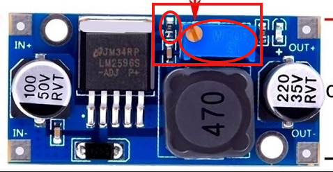

# ⚡ ESP32C3-Based Voltage-Controlled Power Supply (LM2596, MCP4017, MOSFETs) THrpugh Web Dashboard

A modular, memory-efficient, mobile-friendly web dashboard and hardware solution for a 3-output (variable + fixed) voltage-controlled power supply using ESP32C3 Super Mini, LM2596, MCP4017 digital potentiometer, MOSFETs, MINI360, and LM1117. Includes live voltage feedback, hardware and software files, mDNS access, and OTA update support. 

Designed and developed by **Aditya Biswas**.  
**Release Date:** October 25, 2025  
**Version:** 1.0.0  

---

## 🚀  Project Description
This project lets you build a robust voltage-controlled bench power supply with output current up to 3A with error margin of 150mV due to MCP4017 128 step and upto 20V range.

* Output 1 (variable 2.5–15V, up to 3A) is based on an LM2596 buck converter module, digitally controlled using an I2C MCP4017 potentiometer, with a MOSFET switch for fast, safe output enable/disable.

* Output 2 (5V fixed) uses a Mini360 buck converter;
* Output 3 (3.3V) uses an LM1117 LDO. Both are switched by MOSFETs.

Powered and managed by an ESP32C3 Super Mini (4MB).

The project contains both the complete hardware design (schematics, PCB, BOM) and software for the web dashboard & logic.
---

## 🚀 Features

- **3 Independent Outputs:**  
  - Output 1: Variable (2.5V–15V, slider+quick-set buttons)
  - Output 2: 5V Fixed
  - Output 3: 3.3V Fixed
- **Responsive Web UI:** Works on desktop & mobile, scales to any device
- **Live Voltage Feedback:** Real-time voltage updates every second
- **Quick Preset Buttons:** Instantly set 3.3V, 5V, 12V, 13.5V for output 1
- **Toggle & Digital Display:** Each output has ON/OFF, voltage readout, and active state indicator
- **Safety Warnings:** Optional warning modal if >5V set on variable output
- **About/Info Popup:** Version, developer, release date, and profile link
- **OTA & mDNS:** Easy OTA update and access on `http://ESP32PS.local`
- **Minimal Flash/RAM Usage:** All code and UI fits comfortably in ESP32-C3 4MB

---

## 🛠 Installation

1. **Dependencies:**  
   - ESPAsyncWebServer ([latest, compatible with ESP32-C3](https://github.com/ESP32Async/ESPAsyncWebServer))
   - AsyncTCP-esphome ([not classic AsyncTCP](https://github.com/ESP32Async/AsyncTCP))
   - ESPmDNS
   - [SW_MCP4017](https://github.com/SparkysWidgets/SW_MCP4017-Library)

2. **Setup:**
   - Copy the full project to your Arduino IDE/workspace
   - Edit `credential.h` with your WiFi and OTA credentials
   - Flash to your device
   - On first boot, monitor Serial for IP address

3. **Tweaking LM2596 to make it digitally controlled:**
   - To control LM2596 digitally desolder the 10K POT [Blue coloured component] and 330 ohm resistance in series 
   - connect One end of the MCP4017 to 1st pin of POT and another pin of MCP4017 to GND side of the 330 ohm resistor as shown below 
   - Solder a 10K resistance from Ouptut to common pad of the POT as shown above such that we have VOUT--10K--FB pin--MCP4017--GND

4. **Access:**
   - Open browser and visit [http://ESP32PS.local](http://ESP32PS.local) (or device IP)

---

## 🖥 Web UI Overview

- Sidebar and modal overlays for about/version information and voltage warnings
- Button to open About popup (bottom right)
- Smart slider and voltage displays
- Clean, dark, mobile-friendly theme

---

## ⚡ Usage

- Toggle each output independently
- Set output 1 voltage with slider or quick buttons (3.3V, 5V, 12V, 13.5V)
- Watch live status and voltage updates
- "Don't show again" disables pop-up for voltage warning

---

## 📝 Example Screenshot

- Dashboard
  

- PCB Bottom
  

- PCB TOP
  

---

## 🧑‍💻 Credits

**Developed by:** Aditya Biswas  
**Release Date:** October 25, 2025  
**View profile:** [https://github.com/adityabiswas](https://github.com/adi04jan)

---

## 🤝 Contributions

Pull requests and feature discussions are welcome. Please open an issue for bugs or suggestions.

---
